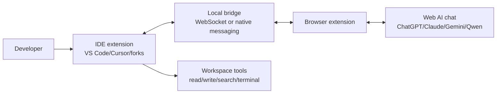

# WebChat Architecture

WebChat turns a normal web AI chat session into the model transport for an agentic coding workflow.

The user stays logged in to a provider such as ChatGPT, Claude, Gemini, or Qwen in a normal headful browser. The IDE extension owns coding tools, workspace context, file edits, diagnostics, terminal commands, and approvals. A browser extension bridges messages between the provider page and the IDE extension.

## Core Idea

Most coding agents talk to a model through an API key. WebChat talks through a real browser chat session.

The IDE extension sends structured prompts to the browser bridge. The browser extension autofills the web chat input, submits the prompt, observes streamed output, and sends response chunks back to the IDE. The IDE parses the model response, runs approved tools, applies edits, and continues the loop.

## Components

### IDE Extension

The IDE extension is the agent host.

- Collects selected files, open editors, diagnostics, symbols, terminal output, and git state.
- Builds prompts with explicit tool-use instructions.
- Tracks session budget, prompt count, and compaction state.
- Shows streamed assistant responses inside the IDE.
- Executes tools only from the trusted local extension process.
- Applies file edits through VS Code APIs.
- Creates new web chat sessions when the configured budget is reached.

### Browser Extension

The browser extension is the provider adapter.

- Detects supported chat pages.
- Injects content scripts for each provider.
- Autofills prompts into the page input.
- Clicks submit using provider-specific selectors.
- Streams visible assistant response text back to the IDE.
- Reports chat lifecycle events: ready, submitted, streaming, complete, blocked, login-required, limit-hit.

The browser extension should not edit files or run tools. It is only a bridge between the web chat page and the IDE extension.

### Local Bridge

The bridge connects the IDE extension and browser extension.

Preferred first implementation:

- Local WebSocket server started by the IDE extension.
- Random session secret printed/sent to the browser extension during pairing.
- Messages use JSON envelopes with a version, id, type, and payload.

Future options:

- Browser native messaging host.
- Shared localhost HTTP/SSE channel.
- Browser extension external messaging where supported.

## Agent Loop

1. User gives a coding request in the IDE chat panel.
2. IDE extension gathers context and builds a provider-neutral prompt.
3. IDE sends the prompt to the browser extension through the local bridge.
4. Browser extension submits the prompt into the active web AI chat.
5. Browser extension streams response text back to the IDE.
6. IDE parser detects tool calls or edit blocks.
7. IDE asks for approval when needed, then runs workspace tools.
8. Tool results are sent back to the web chat as the next prompt.
9. The loop continues until the task is complete or the session policy says to compact or rotate chats.

## Session Policy

Each provider session has:

- `maxInputTokens`: approximate budget for prompt/context sent into one chat session.
- `maxOutputTokens`: approximate budget for response text received from one chat session.
- `compactEveryPrompts`: default `5`.
- `rotateWhenBudgetRemainingBelow`: percentage of budget where a fresh chat is preferred.

After every 5 prompts, WebChat should ask the assistant to produce a compact development state:

- Current objective.
- Decisions made.
- Files changed.
- Important constraints.
- Next actions.
- Known errors or failing tests.

When the current web chat is exhausted, the IDE starts a new provider chat and seeds it with the latest compacted state plus current workspace facts.

## Prompt Contract

Prompts should clearly separate:

- User request.
- System behavior instructions.
- Workspace context.
- Tool result messages.
- Compaction request.
- Provider-specific limitations.

The model should respond with either:

- Natural language for the user.
- Structured tool requests for the IDE extension.
- Structured edit blocks for files.
- A compacted session state.

## Safety Rules

- The browser extension never executes local tools.
- The IDE extension never trusts arbitrary page scripts.
- All bridge messages include a session id and nonce/secret.
- File edits use reviewed diffs or constrained edit formats.
- Terminal commands require an approval policy.
- Secrets are redacted from prompt context by default.

## First Milestone

Build a local end-to-end loop with manual provider submission:

1. IDE chat panel accepts a user request.
2. IDE builds prompt and copies/sends it to the browser bridge.
3. Browser extension injects prompt into one provider.
4. Browser extension streams visible response text back.
5. IDE displays the stream.
6. IDE recognizes compaction triggers and token/session limits.

## Reference Direction

CodeWebChat is the closest existing reference for the editor-plus-browser shape. WebChat should keep the proven parts: local browser bridge, provider-specific adapters, structured prompts, context selection, and editor-side response application.

The main difference is that WebChat is intended to become an agent host. The browser chat is only the model transport; the IDE extension owns tools, approvals, edits, diagnostics, tests, session memory, and compaction. See `docs/reference-analysis.md` for the detailed comparison and build order.
